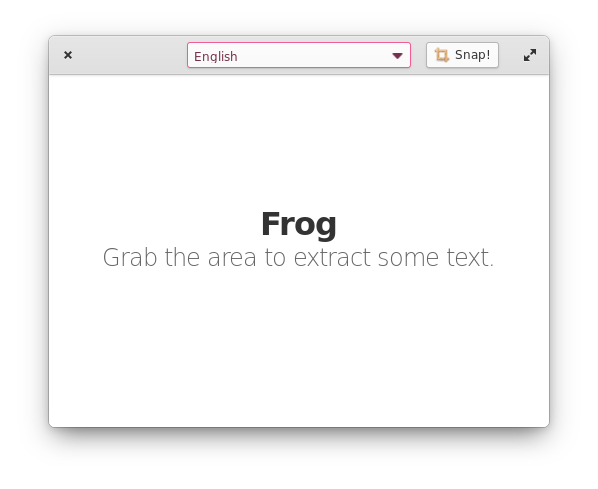

# Frog

> Text extraction tool for elementary OS.

<figure>

</figure>

Quickly extract text from almost any source: youtube, screencasts, PDFs, webpages, photos, etc.
Grab the image and get the text.

<figure>

</figure>

## See it in action

<video controls src="https://user-images
<noscript></noscript>.githubusercontent.com/519146/129591083-b846c776-9616-48b3-8d4f-0565b220e4c1.mp4" />

## Get it from the elementary OS AppCenter!

Will be available soon!

## Get it from Flathub!

Will be available soon!

## :tada: Support
If you like Frog and you want to support its development, consider donating via Liberapay:  

## Install it from source
You can install frog by compiling from source, here's the list of dependencies required:
 - `gtk+-3.0>=3.22.29`
 - `granite>=6.1`
 - `glib-2.0`
 - `gobject-2.0`
 - `meson`
 - `python>=3.6`

## Building

I'm the guy who loves GUI tools instead of command-line thus I recommend using [Builder](https://wiki.gnome.org/Apps/Builder) to develop applications.
To build the frog application just open project folder in Builder and press "Execute" (F5). It will download requirements and build the app.

# Contribution

Any help is appreciated :)

